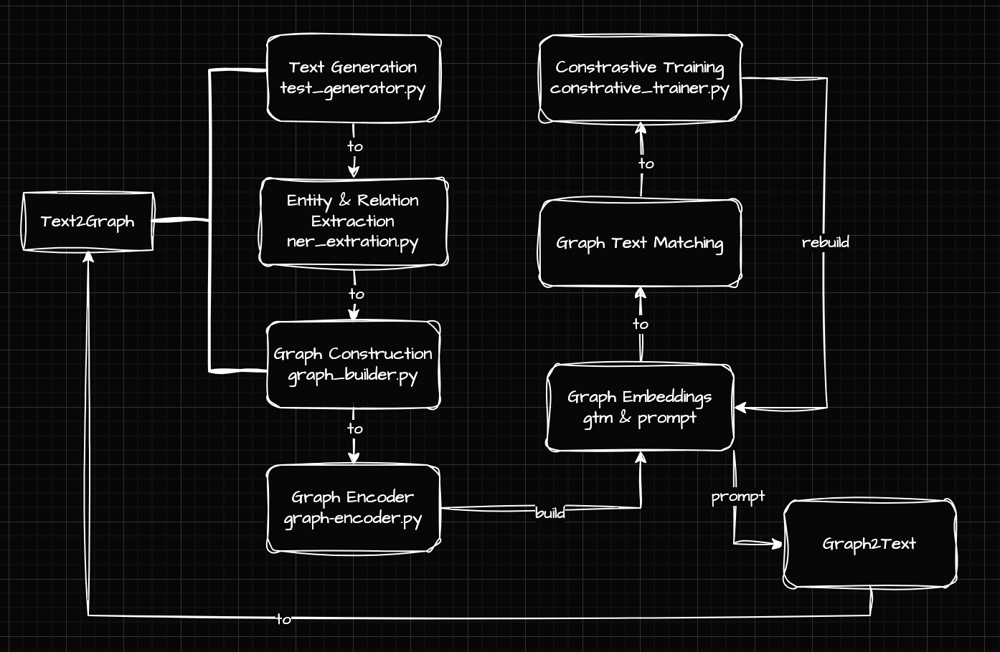

# text2graph2text 模型实验项目

**text2graph2text** 是一个基于 GPT 和图神经网络 (GNN) 的循环式 Text→Graph→Text 微调框架，旨在将文本信息结构化为图，利用图结构进行增强编码，再生成高质量文本。该项目包含数据处理、模型训练、评估与可视化等完整实验流程，最终产出一个可在 Hugging Face 发布的微调模型。

---

## 模型结构

---

## 目录结构

```
text2graph2text/                  # 项目根目录
├── environment.yml               # Conda 环境定义
├── notebooks/                    # Jupyter 实验与可视化笔记
│   └── 01_data_processing.ipynb
│   └── 02_model_training.ipynb
│   └── 03_evaluation.ipynb
├── src/                          # 代码实现
│   ├── __init__.py
│   ├── data_loader.py            # 数据集加载与预处理
│   ├── graph_builder.py          # 文本→图转换逻辑
│   ├── gnn_model.py              # GNN 网络结构定义
│   ├── gpt_finetune.py           # GPT 微调脚本
│   ├── trainer.py                # 训练循环与日志管理
│   ├── evaluator.py              # 评估与指标计算
│   └── utils.py                  # 通用工具函数
├── config/                       # 参数配置
│   └── config.yaml               # 数据路径、超参等
├── data/                         # 原始与中间数据
│   ├── raw/                      # 原始文本语料
│   └── processed/                # 转换后的图数据
├── outputs/                      # 实验结果与模型权重
│   ├── logs/                     # TensorBoard 日志 & checkpoint
│   └── models/                   # 最终微调模型文件
└── README.md                     # 本文件
```

---

## 环境配置

使用 Conda 构建统一的实验环境：

```bash
conda env create -f environment.yml      # 首次创建
conda env update -f environment.yml --prune  # 更新已有环境
conda activate text2graph2text
```

### environment.yml 核心依赖

```yaml
name: text2graph2text
channels:
  - nvidia
  - pytorch
  - conda-forge
  - defaults
dependencies:
  - python=3.10
  - pytorch=2.1.0
  - torchvision=0.16.0
  - torchaudio=2.1.0
  - pytorch-cuda=11.8
  - pyg-lib
  - pyg-sparse
  - pyg-scatter
  - torch-geometric=2.4.0
  - numpy>=1.26,<2.0
  - pandas
  - scikit-learn
  - networkx
  - spacy
  - nltk
  - jupyterlab
  - matplotlib
  - tqdm
  - pip
  - pip:
      - transformers>=4.39
      - sentence-transformers
      - diffusers
      - datasets
      - faiss-cpu
      - accelerate
      - deepspeed
      - wandb
      - python-dotenv
      - jinja2
      - langdetect
```
