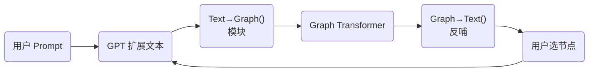

# 研究报告：基于图神经网络的语义结构生成与循环建模

## 一、研究背景与目标

随着大规模语言模型（LLM）在自然语言处理领域的突破，如何将文本生成与结构化知识紧密结合，成为提升模型可解释性与推理能力的重要方向。本研究提出了一种**Text→Graph→Text 循环式框架**，融合 GPT 语言生成与图神经网络（GNN）建模，通过多轮迭代实现语义结构智能生成与可逆变换。

**主要目标：**

* 构建双向可控的循环架构，实现文本与图结构之间的信息互补。
* 使用 Graph Transformer 和对比学习优化，实现多跳、多类型关系的深度建模。
* 针对实体语义聚类任务，提高生成内容的丰富度、连贯性与可读性。

---

## 二、核心方法与模块

### 1. Text→Graph→Text 循环机制

#### 1.1 架构概览

#### 1.2 关键子任务

| 子任务    | 描述                                 |
| ------ | ---------------------------------- |
| 文本→图   | 基于 NER + RE 或 LLM 模板抽取实体与关系        |
| 图→文本   | Graph2Text Transformer 或基于模板生成连贯文本 |
| 循环控制机制 | 控制生成不离题；可设定最大迭代次数及节点优先级策略          |
| 节点跟踪机制 | 标记“已探索/未探索”节点，防止生成过程过度发散           |
| 多轮记忆   | 引入历史嵌入跟踪器，保证跨轮一致语义                 |

#### 1.3 实验标准

1. Text1→Graph→Text2 与原文相似度（BLEU/ROUGE）
2. Graph1→Text→Graph2 结构一致性（Graph Edit Distance）
3. 内容丰富度（Novelty 指标）
4. 生成文本可读性与连贯性（人工评分）

---

### 2. Graph Transformer 多关系建模

| 子任务   | 描述                                              |
| ----- | ----------------------------------------------- |
| 节点初始化 | 实体类型 + GPT 上下文向量组合，生成初始 node embedding          |
| 边类型建模 | Relation-aware Attention，为不同关系类型分配可学习 embedding |
| 全局注意力 | 使用 Transformer 跨节点注意力替代局部聚合，捕捉远程依赖              |
| 多跳表达  | 引入 Relational Positional Encoding，加强多跳语义理解      |

**性能对比：** GraphSAGE / GAT / Graphormer
**泛化测试：** 新语义关系上零样本泛化能力
**可视化：** Attention 权重聚焦验证

---

### 3. 对比学习优化

| 子任务   | 描述                                  |
| ----- | ----------------------------------- |
| 样本对构建 | 正样本：同主题子图；负样本：语义不相关子图               |
| 图增强方法 | 子图裁剪、随机边扰动、多视图生成                    |
| 损失函数  | InfoNCE / NT-Xent，优化节点间相似度          |
| 嵌入评估  | t-SNE / UMAP 可视化嵌入分布；聚类指标 NMI / ARI |

**鲁棒性测试：** 图结构扰动前后相似性比较

---

## 三、技术栈与工具

| 模块     | 工具或库                                               |
| ------ | -------------------------------------------------- |
| 深度学习平台 | PyTorch、HuggingFace Transformers、PyTorch Geometric |
| 分布式训练  | HuggingFace Accelerate / DeepSpeed                 |
| 数据处理   | Pandas、NumPy、NetworkX                              |
| NLP 基础 | spaCy、NLTK                                         |
| 实验管理   | Weights & Biases、TensorBoard                       |
| 可视化    | Matplotlib、Seaborn、Plotly、MermaidJS                |
| 微调与导出  | transformers.Trainer / 自定义 Trainer                 |

---

## 四、实验设计与流程

1. **数据预处理**：运行 `notebooks/01_data_processing.ipynb` 生成图数据
2. **基线实验**：在 `02_model_training.ipynb` 中对比 GAT、GraphSAGE、Graphormer
3. **循环架构验证**：完成 Text→Graph→Text 循环微调，记录各轮效果
4. **对比学习增强**：引入 Contrastive Loss，分析嵌入改进
5. **最终评估**：使用 `03_evaluation.ipynb` 生成报告与可视化结果

---

## 五、研究进度规划

| 阶段    | 任务                                     | 时间节点              |
| ----- | -------------------------------------- | ----------------- |
| 准备阶段  | 文献调研、理论学习、工具熟悉                         | Week 1 – Week 2   |
| 实验阶段  | Text→Graph、Graph Transformer、对比学习三项子实验 | Week 3 – Week 6   |
| 集成阶段  | 构建循环框架，综合微调实验                          | Week 7 – Week 9   |
| 验证与优化 | 参数搜索、实验稳定性与可重复性                        | Week 10 – Week 11 |
| 总结与撰写 | 撰写论文、提交模型、答辩准备                         | Week 12 – Week 13 |

---

## 六、预期成果

1. 在 Hugging Face 发布经过微调的 `text2graph2text` 模型
2. 提交论文或技术报告，深入分析循环建模与对比学习在图结构生成中的优势
3. 完整实验代码、数据与笔记开放，确保可复现性