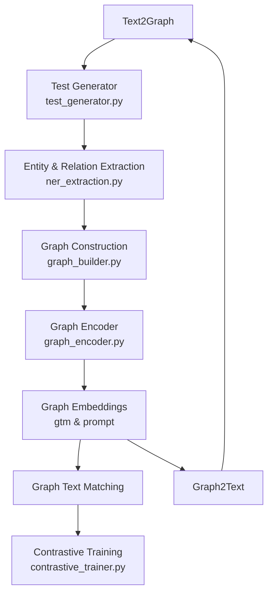

# 知识增强双向 Text↔Graph 系统设计研究报告

> 作者：赵明俊
> 日期：2025年7月
> 主题：闭环 Text2Graph 与 Graph2Text 系统架构设计与分析!

---

## 摘要

本报告针对一套**双向闭环 Text2Graph ↔ Graph2Text** 系统进行深入分析与研究。该系统包含文本生成、实体关系抽取、知识图谱构建与编码、图文对齐与对比训练，以及基于图谱驱动的文本生成。我们从整体架构、模块职责、数据流转、关键技术与创新点等方面展开，最后给出实验与产品化建议。

---

## 1. 引言

随着大规模语言模型（LLM）和图神经网络（GNN）技术的兴起，如何将**结构化知识图谱**与**自然语言生成**紧密结合，成为提升系统语义理解与生成准确性的关键。本系统采用**闭环设计**，既能从文本中挖掘图结构，又能以图驱动文本生成，实现文本与图谱的相互增强。

---

## 2. 系统架构总览

* **Text2Graph**：从文本生成知识三元组并构建图结构。
* **Graph Embeddings ↔ Contrastive Training**：将图与文本表示映射到共享空间，实现对齐与检索。
* **Graph2Text**：利用图嵌入与 prompt 模块生成连贯文本。

---

## 3. 模块职责与实现

| 模块                   | 文件                       | 功能描述                                           |
| -------------------- | ------------------------ | ---------------------------------------------- |
| 文本生成（Test Generator） | `test_generator.py`      | 生成或收集用于训练与验证的文本片段。                             |
| 实体关系抽取               | `ner_extraction.py`      | 基于 NER、RE 技术抽取文本中的实体和关系三元组。                    |
| 图构建                  | `graph_builder.py`       | 将抽取的三元组组织为图数据库或内存图结构，并处理实体对齐。                  |
| 图编码                  | `graph_encoder.py`       | 使用 GNN（如 GCN、GAT、R-GCN）或图 Transformer 编码节点与子图。 |
| 图嵌入 & Prompt 生成      | `gtm & prompt`           | 将图编码输出映射为向量并生成 LLM prompt 的输入模板。               |
| 图文匹配                 | `graph_text_matching`    | 构造正负样本对，计算图-文相似度，用于检索与对齐。                      |
| 对比训练                 | `contrastive_trainer.py` | 基于 InfoNCE 等对比损失联合训练图与文本编码器。                   |
| 文本生成（Graph2Text）     | `graph2text`             | 以图嵌入与 prompt 作为输入，驱动 LLM 生成描述文本。               |

---

## 4. 数据流转与循环逻辑

1. **文本生成 → 抽取 → 构建**：`test_generator` 产生输入，`ner_extraction` 提取实体关系，`graph_builder` 构建初步知识图谱。
2. **编码 → 嵌入 → 对齐**：`graph_encoder` 对图结构编码，`gtm & prompt` 生成向量与 prompt，`graph_text_matching` 构建图-文对齐对，`contrastive_trainer` 训练对比模型。
3. **生成 → 回环**：`graph2text` 使用优化后模型生成文本，将新文本输入回 `Text2Graph` 端，形成增强循环。

---

## 5. 关键技术与创新点

* **闭环设计**：支持 Text2Graph 与 Graph2Text 的端到端循环增强，信息双向流动。
* **动态 Prompt 构造**：根据图编码自动生成 LLM prompt，提升生成连贯性与事实准确性。
* **对比学习对齐**：使用图-文对比损失实现跨模态统一向量空间，提高检索与生成效果。
* **模块化解耦**：各阶段拆分为独立服务（或脚本），便于替换、扩展与部署。

---

## 6. 实验设计与评估指标

| 任务               | 数据集示例            | 评估指标                     |
| ---------------- | ---------------- | ------------------------ |
| 三元组抽取            | CoNLL04、ACE2005  | Precision / Recall / F1  |
| 图编码与匹配           | FB15k-237、WN18RR | Hits\@K, MRR             |
| 文本生成（Graph2Text） | WebNLG、AgenTalk  | BLEU / ROUGE / BERTScore |

---

## 7. 产品化部署要点

* **微服务拆分**：Text2Graph、Graph2Text、Embedding Service、Trainer Service。
* **存储选型**：Neo4j（显式图）、PostgreSQL（元数据）、Qdrant（向量检索）。
* **流程调度**：FastAPI + LangChain 作为统一入口与工具编排。

---

## 8. 结论

该系统设计将 NLP 与 GNN 技术有机结合，通过闭环流水线实现知识抽取与生成的互相强化，兼具学术研究价值与工程落地潜力，可为多种智能应用提供丰富的结构化语义支撑。